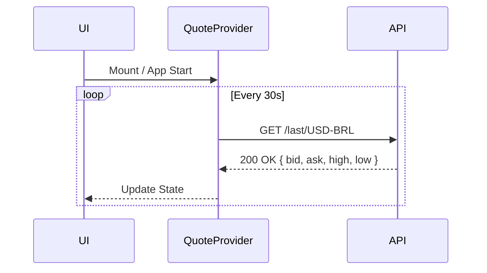

# Arquitetura USD Alert 🏗️

Este documento descreve a arquitetura técnica, fluxo de dados e decisões de design do projeto USD Alert.

## Visão Geral

O USD Alert é uma aplicação **PWA (Progressive Web App)** focada em performance e funcionamento offline, com capacidades de **Push Notification** para alertar usuários sobre cotações do dólar.

### Componentes Principais

1.  **UI (React + Tailwind)**: Interface do usuário para exibir cotação e configurar alertas.
2.  **Quote Provider**: Contexto React/Hook responsável por buscar a cotação da API (ex: AwesomeAPI ou similar) em intervalos regulares (`polling`).
3.  **Notification Scheduler**: Lógica (client-side) para verificar se a cotação atual atinge os critérios do usuário para disparar notificação local (se app aberto) ou solicitar push.
4.  **Service Worker (SW)**:
    *   **PWA SW (@vite-pwa/plugin)**: Cache de assets (JS, CSS, HTML, Imagens) para funcionamento offline.
    *   **Firebase Messaging SW**: Background worker para receber pushes do FCM quando o app está fechado/background.
5.  **Firebase (Backend-as-a-Service)**:
    *   **FCM (Cloud Messaging)**: Canal de entrega de mensagens push.
    *   **Firestore (Opcional)**: Persistência de tokens de dispositivos vinculados a preferências de usuário (necessário apenas se usarmos envio centralizado via backend).

## Fluxos de Dados

### 1. Carregamento de Cotação

### 2. Registro de Push (Instalação)
1.  Usuário abre o app.
2.  App solicita permissão `Notification.requestPermission()`.
3.  Se `granted`, app chama `getToken(messaging, { vapidKey })` do Firebase SDK.
4.  Token gerado é salvo no `localStorage` e (opcionalmente) enviado ao Firestore junto com ID do usuário/dispositivo.

### 3. Disparo de Push (Estratégias)

#### A) App Aberto (Foreground)
O próprio app monitora a cotação. Se ultrapassar o limite, dispara `new Notification("Alerta Dólar...")`. Não gasta quota do FCM/Backend.

#### B) App Fechado (Background)
Requer um agente externo (Cron/Backend).
1.  **Cron Job** (Github Actions / Vercel Cron / Cloud Scheduler) roda a cada X minutos/horas.
2.  Busca cotação atual.
3.  Busca no Banco de Dados (Firestore) usuários interessados nesse valor ou horário.
4.  Envia comando para API do FCM enviar push para os tokens listados.
5.  FCM entrega mensagem ao **Service Worker** do dispositivo.
6.  SW exibe notificação nativa.

*Nota: Na versão gratuita inicial, focamos em alertas manuais ou verificação periódica via Cron simples para todos os usuários (Broadcast).*

## Decisões Técnicas e Trade-offs

| Decisão | Motivo | Trade-off |
| :--- | :--- | :--- |
| **Vite + React** | Performance e DX moderna. | Setup de SW requer atenção no build. |
| **Firebase "Spark" (Free)** | Custo zero. | Sem Cloud Functions agendadas (requer "Blaze"). Usamos notificações locais ou cron externo. |
| **PWA vs Nativo** | Distribuição simplificada (URL), sem loja. | Limitação no iOS (push web é recente), sem widget nativo real na home screen. |
| **LocalStorage** | Simplicidade e privacidade. | Dados somem se limpar cache. Preferências não sincronizam entre dispositivos. |

---
**Links Úteis:**
- [Firebase Architecture](https://firebase.google.com/docs/web/setup)
